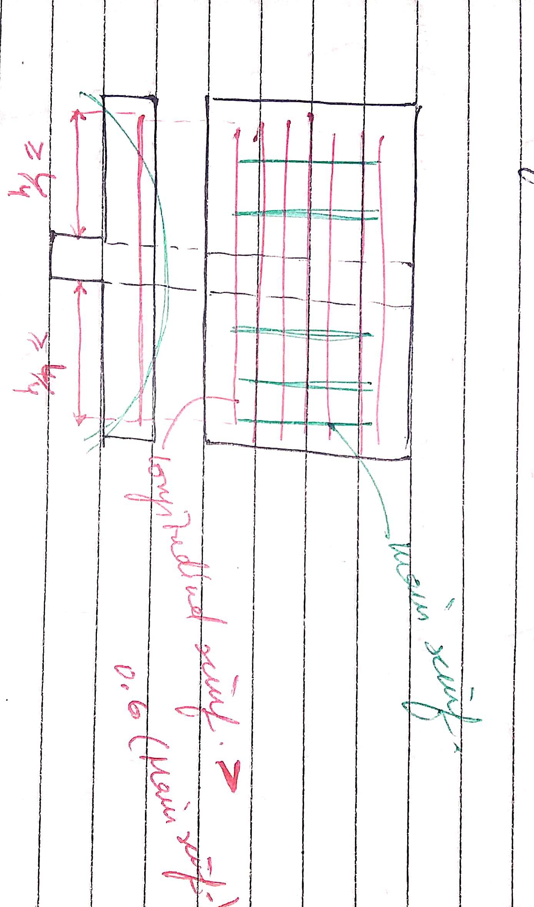
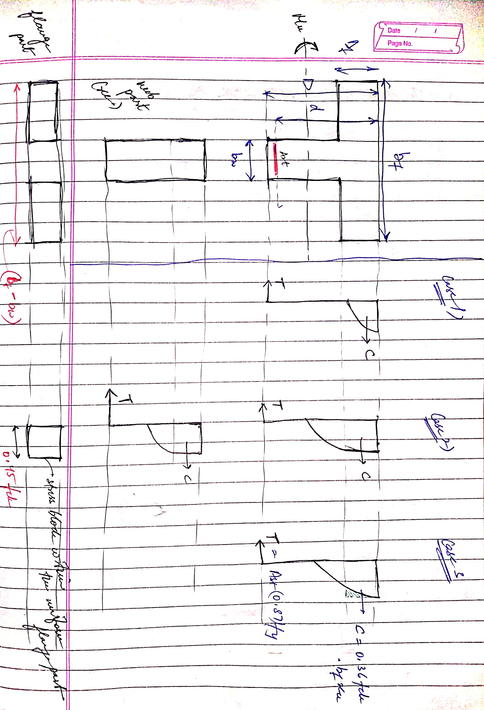

# T-Beam
-
## Assumptions 
The slab is assumed to act as a compression flange only if: [IS 456 - 2000 Cl 23.1.1] 
  1. Web and slab effectively bond together or are cast integrally 
  2. If the main reinforcement in the slab or flange is parallel to the beam then the longitudinal reinforcement will be 60% of the main reinforcement, as shown: 
     - 
## Analysis and Design
<math>
Three cases to be considered while designing the flanged beam - 
  Case 1. Neutral Axis lies within the flange (xu &#60; Df) 
  Case 2. Neutral Axis lies below the flange (xu &#62; Df) & flange is uniformly stressed (Df/d &#60; 0.2) 
  Case 3. Neutral Axis lies below the flange (xu &#62; Df) & flange is not uniformly stressed (Df/d &#62; 0.2) 
  
  - 
  
To check whether NA lies within the flange or not -  
  Df/d = (0.0035-0.002)/(0.0038+0.0035) 
  Df/d = 0.2  
  xu/d &#60; Df/d &rarr; NA lies within the flange 
  xu/d &#62; Df/d &rarr; NA lies below the flange area 
  
  Considering the three cases, checking where NA lies - 
  Case 1. Neutral Axis lies within the flange (xu &#60; Df) 
  - 
    Mu,lim = 0.36fckxu(d-0.42xu)bf [IS 456 - 2000 ANNEX-G] 
  xu/d can be calculated from - Mu,lim = 0.36fck(xu/d)(1-0.42(xu/d))bfd^2 
  
  When xu = Df, replacing xu with Df: 
    Mu.lim = 0.36fckDf(d-0.42Df)bf 

  If only cross-section of the beam is given - 
    depth of neutral axis = xu/d = 0.87fyAst/0.36fckbfd [IS 456 - 2000 ANNEX-G Cl 38.1 G-1.1] 
    or 
    xu = 0.87fyAst/0.36fckbf 

  Case 2. Neutral Axis lies below the flange (xu &#62; Df) & flange is uniformly stressed (Df/d &#60; 0.2) 
    Mu1 = 0.36fckbwxu(d-0.42xu) 
    Mu2 = 0.45fckDf(bf-bw)(d-0.5Df) 
    Mu = Mu1 + Mu2 
       = 0.36fckbwxu(d-0.42xu) + 0.45fckDf(bf-bw)(d-0.5Df) [IS 456 - 2000 ANNEX-G G-2.2] 
  Case 3. Neutral Axis lies below the flange (xu &#62; Df) & flange is not uniformly stressed (Df/d &#62; 0.2) 
    yf = 0.15xu + 0.65Df instead of Df is to be substituted in - [IS 456 - 2000 ANNEX-G G-2.2.1] 
    Mu = = 0.36fckbwxu(d-0.42xu) + 0.45fckyf(bf-bw)(d-0.5yf)  
    Note that - yf &#60; Df always 
  - 
### Design steps for T-Beam
Step 1. Assume the dimensions of T-Beam  
d = span/12 to Span/15  
bw = 150 mm to 400 mm  
    or 
     d/2 to d/3 
Effective cover to be assumed as 40 to 50 mm 

Step 2. Calculate the effective span of the beam (lo) 
lo being c/c of two supports or between two points of contraflexure (assume width of supports if not given) 

Step 3. Find the effective width of flange (bf) [IS 456 - 2000 Cl 23.1.2] 
In no case should bf be more than bw + 1/2(clear distance to the adjacent beams on either side) 
bf = lo/6 + bw + 6Df  
For Isolated T-Beam &rarr; 
bf = lo/((lo/b)+4) + bw 

Step 4. Load Calculations 
Calculate the self-weight/dead load (Wd) of the T-Beam 
Self-weight of the flange + Self-weight of the web 
(Assume superimposed load (Ws) of not given in the question) 
Total Load = Superimposed Load + Self-weight 
Wu = Ws + Wd 
Find the factored design load (factored design UDL per m length of the beam) 

Step 5. Calculate factored design moment (Ultimate maximum bending moment Mu) 
Mu = Wul^2/8 

Step 6. Find the area of reinforcement 
Different cases that arrive are - 
(a) Assume Df/xu &le; 0.43 and neglect contribution of rib in resisting moment 
Calculate Mu,lim 
  Mu,lim = 0.45fckDfbf(d-0.5Df) 
If Mu &#60; Mu,lim Singly reinforced section is to be designed  
If Mu &#62; Mu,lim Doubly reinforced section is to be designed  

(b) If Mu &#60; Mu,lim determine ultimate moment of resistance Mu' 
  Mu' = 0.36fckbfDf(d-0.42Df) [Assuming xu = Df i.e., considering that the neutral axis coincides with the bottom of the flange] 

  If Mu &#60; Mu' then xu &#60; Df 
  &there4; Find Ast from the relation: 
    Mu = 0.87fyAst[d-(fsAst/fckbf)] 

(c) If Mu &#62; Mu' but less than Mu,lim determine ultimate moment of resistance Mu" 
  Mu" = 0.36fckbwxu(d-0.42xu) + 0.45fckDf(bf-bw)(d-0.5Df) [Assume Df/x = 0.43] 

  If Mu &#62; Mu" then Df/xu &#60; 0.43 

  Now determine xu corresponding to Mu for Df/xu &#60; 0.43 
    Mu = 0.36fckbwxu(d-0.42xu) + 0.45fckDf(bf-bw)(d-0.5Df) 
  Calculate Ast from the known value of xu 
    Ast = 0.36fckbwxu + 0.45fckDf(bf-bw)/0.87fy 

  If Mu &#60; Mu" then Df/xu &#62; 0.43 

  Now determine xu corresponding to Mu by solving the quadratic equation in xu 
    Mu = = 0.36fckbwxu(d-0.42xu) + 0.45fckyf(bf-bw)(d-0.5yf) 
  Calculate Ast from the known value of xu  
    Ast = 0.36fckbwxu + 0.45fckyf(bf-bw)0.87fy 

Step 7. Check for Shear and design shear reinforcement if needed. 
Step 8. Check for development length  
Step 9. Check for deflection to satisfy the limit state of serviceability. 
Step 10. Write a summary of the design and draw a neat sketch. 

### Example:

Given values: 
bf = 1000 mm 
Df = 125 mm 
bw = 250 mm 
D = 400 mm 
Area of tensile steel = 5-20&Phi; 

d = D - clear cover - &Phi;/2 
  = 400 - 25 - 20/2 
  = 365 mm 
Ast = 5&Pi;(20)^2/4 

1. Assuming tensile steel yields: 
  xu = 0.87fyAst/0.36fckbf 
     = 52.48 mm 
  xu &#60; Df, So we can say that NA is within the flange 

2. Lever arm depth 
   z = (d - 0.42xu) 
     = 342.9584 mm 

3. Moment of resistance due to concrete failure 
   MORc = Mu = Cz = 0.36fckbfxuz = 194.378 KNm 

4. Moment of resistance due to steel yield 
   MORt = Mu = Tz = 0.87fyAstz = 194.4 KNm 

  NA lies within the flange so we can calculate the Moment of resistance either for concrete or steel both. 
  
</math>
