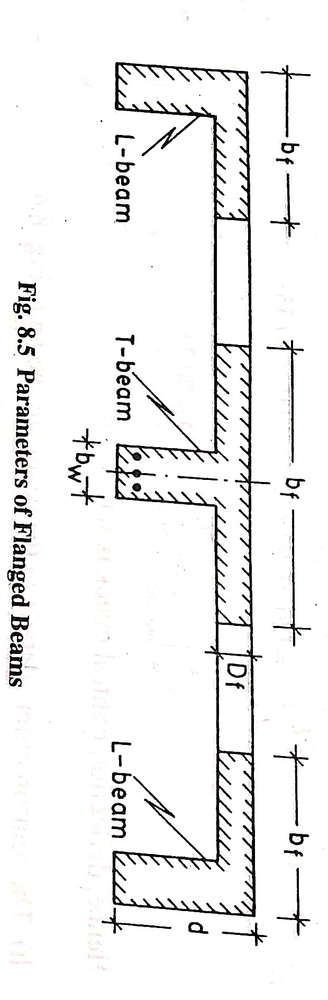
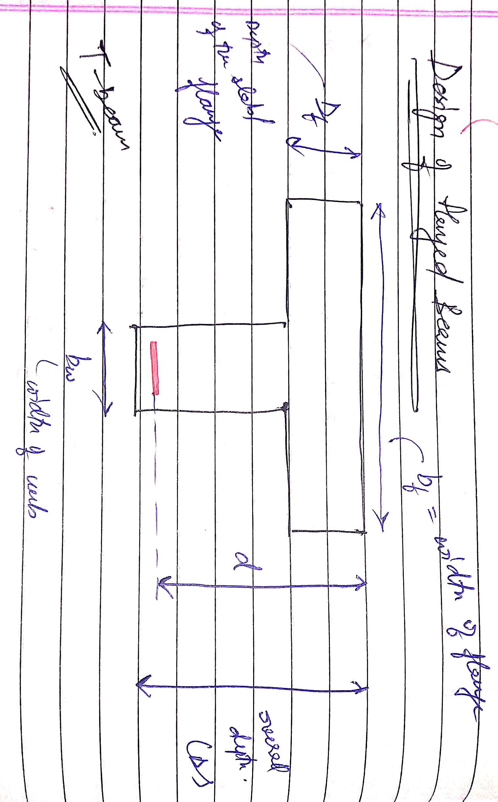
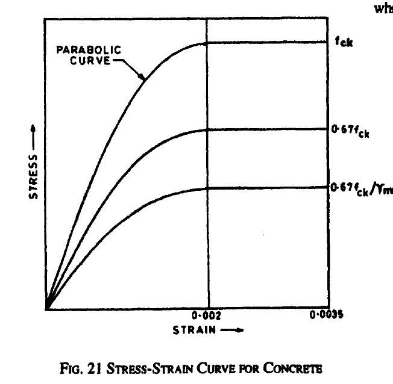
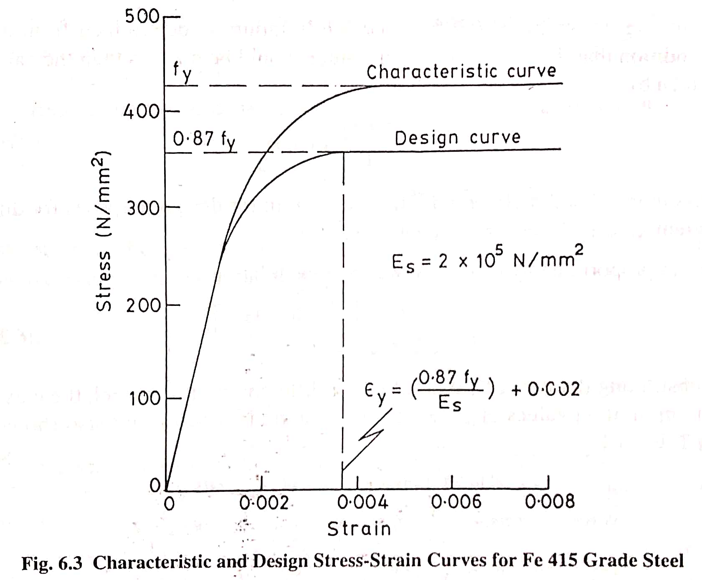
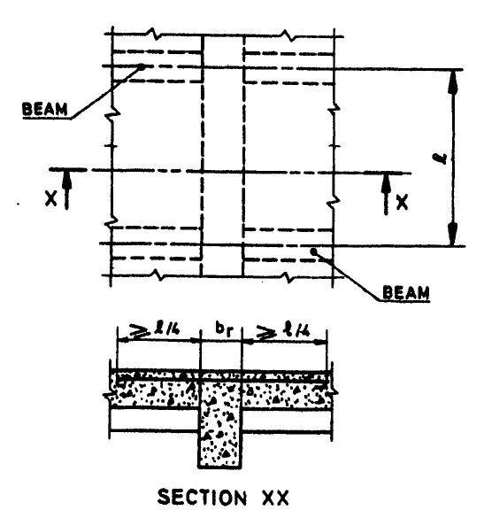
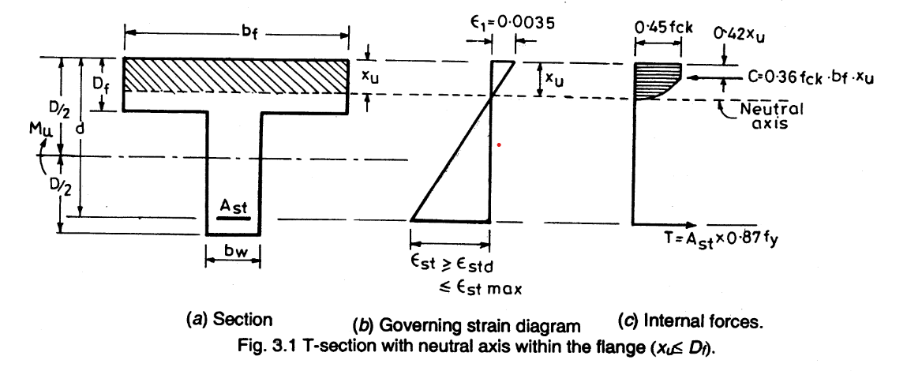
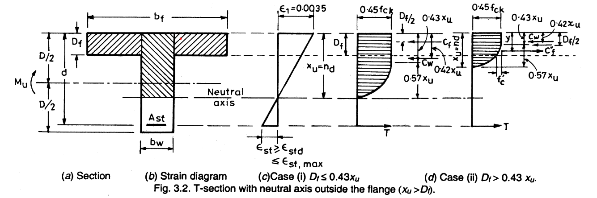

# T-Beam
-
-
## Assumptions 

Following are the assumptions made in the theory of Simple Bending: 

1. The material of the beam is homogenous and isotropic. 

2. The beam is initially straight, and all the longitudinal fibers bend in circular arcs with a common center of curvature. 

3. Members have symmetric cross-sections and are subjected to bending in the plane of symmetry. 

4. The beam is subjected to pure bending and the effect of shear is neglected. 

The following assumptions are relevant in the computation of the ultimate flexural strength of reinforced concrete sections: [IS: 456- 2000 Clause 38.1]

1) Plane sections normal to the axis remain plane after bending. (strain at any point on the cross-section is directly proportional to its distance from the neutral axis)

2) The maximum strain in concrete at the extreme compression fiber is assumed as 0.003 in flexure

3) The relationship between the compressive stress distribution in concrete and the strain in concrete may be assumed to be rectangle, trapezoid, parabola, or any other shape which results in strength prediction in substantial agreement with the test results. The recommended stress-strain curve is shown below which shows the characteristic and design strength curves.

- 

4) Tensile strength of concrete is ignored.

5) The stresses in the reinforcement are obtained from the stress-strain curves shown below. For design purposes, the partial safety factor Ym equal to 1.15 is applied to compute the design strength.

- 

6) The maximum strain in the tension reinforcement in the section at the collapse limit state shall be not less than $$[\frac{f_y}{1.15E_s}+0.002] = [\frac{0.87f_y}{E_s}+0.002]$$

   
The slab is assumed to act as a compression flange only if: [IS 456 - 2000 Cl 23.1.1]
  1. Web and slab effectively bond together or are cast integrally
  2. If the main reinforcement in the slab or flange is parallel to the beam then the longitudinal reinforcement will be 60% of the main reinforcement, as shown:
     -
     -
## Analysis and Design
<math>

Three cases to be considered while designing the flanged beam -

  
Case 1. Neutral Axis lies within the flange (xu &#60; Df)

  
Case 2. Neutral Axis lies below the flange (xu &#62; Df) & flange is uniformly stressed (Df/d &#60; 0.2)

  
Case 3. Neutral Axis lies below the flange (xu &#62; Df) & flange is not uniformly stressed (Df/d &#62; 0.2)

 
  -
  

To check whether NA lies within the flange or not - 

  
$$\frac{D_f}{d} = \frac{0.0035-0.002}{0.0038+0.0035}$$

  
Df/d = 0.2 

  
xu/d &#60; Df/d &rarr; NA lies within the flange

  
xu/d &#62; Df/d &rarr; NA lies below the flange area

  
  
Considering the three cases, checking where NA lies -

  
Case 1. Neutral Axis lies within the flange (xu &#60; Df)

  
  -

  
$$M_{u,lim} = 0.36f_{ck}x_u(d-0.42x_u)b_f$$ [IS 456 - 2000 ANNEX-G]

  
xu/d can be calculated from - $$M_{u,lim} = 0.36f_{ck}(\frac{x_u}{d})(1-0.42(\frac{x_u}{d}))b_fd^2$$

  
  
When xu = Df, replacing xu with Df:

    
$$M_{u.lim} = 0.36f_{ck}D_f(d-0.42D_f)b_f$$

  
If only a cross-section of the beam is given -

    
depth of neutral axis = $$\frac{x_u}{d} = \frac{0.87f_yA_{st}}{0.36f_{ck}b_fd}$$ [IS 456 - 2000 ANNEX-G Cl 38.1 G-1.1]

    
or

    
$$x_u = \frac{0.87f_yA_{st}}{0.36f_{ck}b_f}$$

  
Case 2. Neutral Axis lies below the flange (xu &#62; Df) & flange is uniformly stressed (Df/d &#60; 0.2)

    
$$M_{u1} = 0.36f_{ck}b_wx_u(d-0.42x_u)$$

    
$$M_{u2} = 0.45f_{ck}D_f(b_f-b_w)(d-0.5D_f)$$

    
$$M_u = M_{u1} + M_{u2}$$

       
$$M_u = 0.36f_{ck}b_wx_u(d-0.42x_u) + 0.45f_{ck}D_f(b_f-b_w)(d-0.5D_f)$$ [IS 456 - 2000 ANNEX-G G-2.2]

       
  
Case 3. Neutral Axis lies below the flange (xu &#62; Df) & flange is not uniformly stressed (Df/d &#62; 0.2)

    
$$y_f = 0.15x_u + 0.65D_f$$ instead of Df is to be substituted in - [IS 456 - 2000 ANNEX-G G-2.2.1]

    
$$M_u = 0.36f_{ck}b_wx_u(d-0.42x_u) + 0.45f_{ck}y_f(b_f-b_w)(d-0.5y_f)$$ 

    
Note that - yf &#60; Df always

    
  -
  
### Design steps for T-Beam

Step 1. Assume the dimensions of T-Beam 

effective depth (d) = span/12 to Span/15 

bw = 150 mm to 400 mm 

    
or

     
d/2 to d/3

Effective cover to be assumed as 40 to 50 mm

Overall depth (D) = effective depth (d) + clear cover

Step 2. Calculate the effective span of the beam (lo)

It will be the least value of:

1. Centre to centre of bearings

2. Clear span + effective depth

lo being c/c of two supports or between two points of contraflexure (assume width of supports if not given)

Step 3. Find the effective width of flange (bf) [IS 456 - 2000 Cl 23.1.2]

In no case should bf be more than bw + 1/2(clear distance to the adjacent beams on either side)

$$b_f = \frac{l_o}{6} + b_w + 6D_f$$ 

For Isolated T-Beam &rarr;

$$b_f = \frac{l_o}{((\frac{l_o}{b})+4)} + b_w$$

Step 4. Load Calculations

Calculate the self-weight/dead load (Wd) of the T-Beam

Self-weight of the flange + Self-weight of the web

(Assume superimposed load (Ws) of not given in the question)

Total Load = Superimposed Load + Self-weight

Wu = Ws + Wd

Find the factored design load (factored design UDL per m length of the beam)

Step 5. Calculate factored design moment (Ultimate maximum bending moment Mu) and Shear Force

$$M_u = \frac{W_ul^2}{8}$$

$$V_u = \frac{W_ul}{2}$$

Step 6. Find the area of reinforcement

Different cases that arrive are -

(a) Assume Df/xu &le; 0.43

Calculate Mu,lim

 
 $$M_{u,lim} = 0.45f_ckD_fb_f(d-0.5D_f)$$

If Mu &#60; Mu,lim Singly reinforced section is to be designed 

If Mu &#62; Mu,lim Doubly reinforced section is to be designed 

(b) If Mu &#60; Mu,lim determine ultimate moment of resistance Mu'

 
 $$M_u^{'} = 0.36f_{ck}b_fD_f(d-0.42D_f)$$ [Assuming xu = Df i.e., considering that the neutral axis coincides with the bottom of the flange]

  
If Mu &#60; Mu' then xu &#60; Df

  
&there4; Find Ast from the relation:

    
$$M_u = 0.87f_yA_{st}[d-(\frac{f_yA_{st}}{f_{ck}b_f})]$$

(c) If Mu &#62; Mu' but less than Mu,lim determine ultimate moment of resistance Mu"

 
 $$M_u^" = 0.36f_{ck}b_wx_u(d-0.42x_u) + 0.45f_{ck}D_f(b_f-b_w)(d-0.5D_f)$$ [Assume Df/x = 0.43]

  
If Mu &#62; Mu" then Df/xu &#60; 0.43

  
Now determine xu corresponding to Mu for Df/xu &#60; 0.43

   
 $$M_u = 0.36f_{ck}b_wx_u(d-0.42x_u) + 0.45f_{ck}D_f(b_f-b_w)(d-0.5D_f)$$

  
Calculate Ast from the known value of xu

    
$$A_st = \frac{0.36f_{ck}b_wx_u + 0.45f_{ck}y_f(b_f-b_w)}{0.87f_y}$$

  
If Mu &#60; Mu" then Df/xu &#62; 0.43

  
Now determine xu corresponding to Mu by solving the quadratic equation in xu

   
$$M_u = 0.36f_{ck}b_wx_u(d-0.42x_u) + 0.45f_{ck}y_f(b_f-b_w)(d-0.5y_f)$$

  
Calculate Ast from the known value of xu 

    
$$A_st = \frac{0.36f_{ck}b_wx_u + 0.45f_{ck}y_f(b_f-b_w)}{0.87f_y}$$

Step 7. Check for shear and design shear reinforcement if needed.

Nominal Shear Stress $$&Tau;_v = [\frac{V_u}{b_wd}]$$

$$p_t = [\frac{100A_{st}}{b_wd}]$$

Calculate &Tau;c (shear stress in concrete) corresponding to the value of &Tau;v

If &Tau;c &#62; &Tau;v then there is no need to design shear reinforcement.

Step 8. Check for development length 

Step 9. Check for deflection to satisfy the limit state of serviceability.

Step 10. Write a summary of the design and draw a neat sketch.

### Example:

Given values:

bf = 1000 mm

Df = 125 mm

bw = 250 mm

D = 400 mm

Area of tensile steel = 5-20&Phi;

d = D - clear cover - &Phi;/2

  
= 400 - 25 - 20/2

 
 = 365 mm

$$Ast = \frac{5\Pi(20)^2}{4}$$

1. Assuming tensile steel yields:

 
 $$x_u = \frac{0.87f_yA_{st}}{0.36f_{ck}b_f}$$

    
 $$= 52.48 mm$$

 
xu &#60; Df, So we can say that NA is within the flange

2. Lever arm depth

   
$$z = (d - 0.42x_u)$$

     
$$= 342.9584 mm$$

3. Moment of resistance due to concrete failure

  
$$MOR_c = M_u = Cz = 0.36f_{ck}b_fx_uz = 194.378 KNm$$

4. Moment of resistance due to steel yield

 
$$MOR_t = M_u = Tz = 0.87f_yA_{st}z = 194.4 KNm$$

 
 NA lies within the flange so we can calculate the Moment of resistance for both concrete and steel.

</math>
Thank you!
