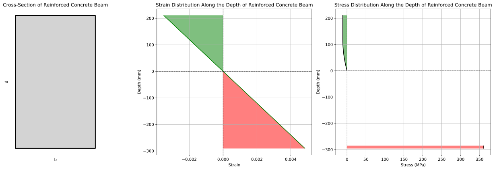

## LIMIT STATE OF COLLAPSE: FLEXURE
### 38.1 Assumptions

38. Design for the limit state of collapse in flexure shall
be based on the assumptions given below:

    1. Plane sections normal to the axis remain plane after bending.
    1. The maximum strain in concrete at the outermost compression fibre is taken as 0.0035 (0.35%) in bending.
    1.  The relationship between the compressive stress distribution in concrete and the strain in concrete may be assumed to be
        - rectangle,
        - trapezoid,
        - parabola or
        - any other shape which results in prediction of strength in substantial agreement with the results of test.
    
    An acceptable stress-strain curve is given in Fig. 21 of IS code. The actual strength of concrete in a structural element, such as a beam and column, is different from the cube strength. This difference is attributed to various factors, including the effects of confinement, size effect, and stress distribution in the structural element. Due to this fact, for the design purposes, the compressive strength of concrete in the structure shall be assumed to be 0.67 times the characteristic strength. The partial safety factor $\gamma_m = 1.5$ shall be applied in addition to this.

    Note$-$ For the stress-strain curve in Fig. 21 the design stress block parameters are as follows (see Fig. 22):
    
    Area of stress block $= 0.36 f_{ck} \times x_u$
    
    Depth of centre of compressive force from the extreme fibre in compression $= 0.42 x_u$

    where

    \begin{eqnarray}
    f_{ck} &=& \text{characteristic compressive strength of concrete, and} \\
    x_u &=& \text{depth of neutral axis.}
    \end{eqnarray}

    - The tensile strength of the concrete is ignored.
    - The stresses in the reinforcement are derived from representative stress-strain curve for the type of steel used. Typical curves are given in Fig. 23. For design purposes the partial safety factor $\gamma_m$ , equal to 1.15 shall be applied.
    - The maximum strain in the tension reinforcement in the section at failure shall not be less than: $$ \frac{f_y}{1.15 E_s} + 0.002$$

    where

    $f_y =$ characteristic strength of steel, and

    $E_s =$ modulus of elasticity of steel.

    
